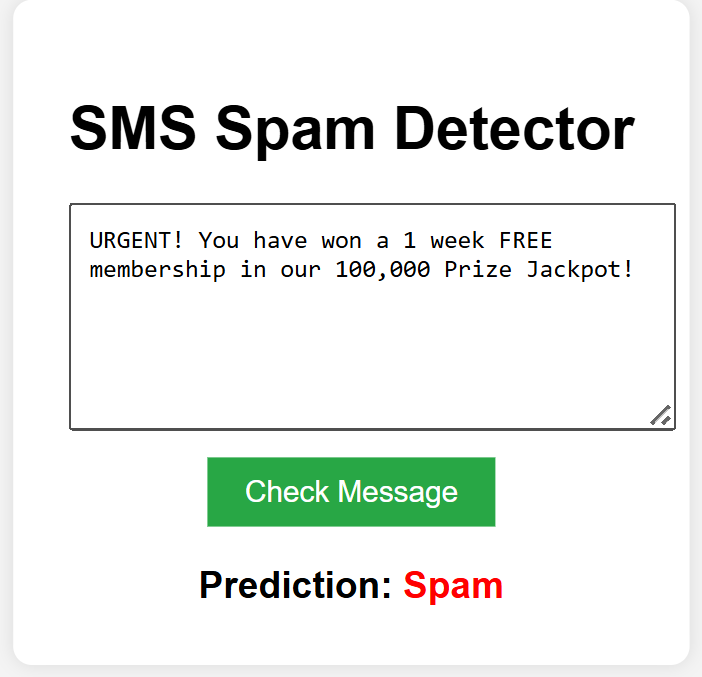
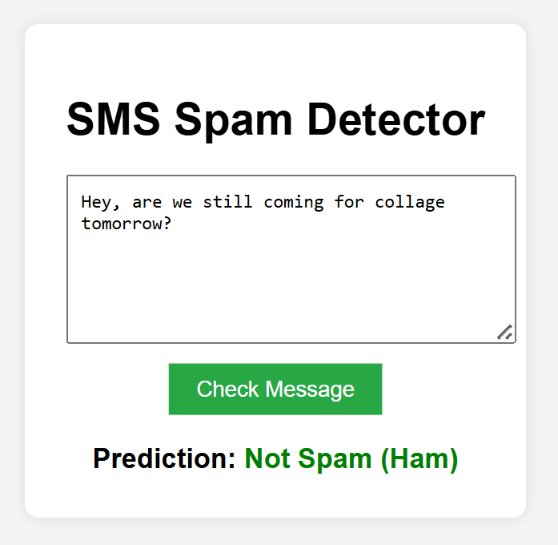

#  SMS Spam Detection Web App

A Machine Learning web application built with **Flask** and **Python** that predicts whether a given SMS message is **Spam** or **Ham** (Normal). The model is trained using the **Multinomial Naive Bayes** algorithm and achieves high precision in detecting spam messages.

##  Features
- **Real-time Prediction:** Instantly classifies messages as Spam or Not Spam.
- **Web Interface:** Simple and user-friendly UI built with HTML/CSS.
- **Machine Learning:** Uses TF-IDF vectorization and Naive Bayes classifier.
- **Data Cleaning:** Implements text preprocessing (stemming, stopword removal) for better accuracy.

##  Demo
  
  

##  Project Structure
```text
SPAM_DETECTION/
│
├── dataset/
│   └── spam.csv               # The raw dataset used for training
│
├── notebook/
│   └── model_training.ipynb   # Jupyter notebook for data analysis & model training
│
├── templates/
│   └── index.html             # HTML file for the web interface
│
├── app.py                     # Main Flask application file
├── model.pkl                  # Trained Machine Learning model
├── vectorizer.pkl             # TF-IDF Vectorizer
├── requirements.txt           # List of dependencies
└── README.md                  # Project documentation
```
1.  **GIT Clone
    ```git clone [https://github.com/itsabhisingh07/Spam-SMS-Detector.git](https://github.com/itsabhisingh07/Spam-SMS-Detector.git)
   cd Spam-SMS-Detector
    ```

2.  **Install dependencies**
    ```bash
    pip install -r requirements.txt
    ```

3.  **Run the application**
    ```bash
    python app.py
    ```

4.  **Open browser**
    Go to `http://127.0.0.1:5000/` to use.


